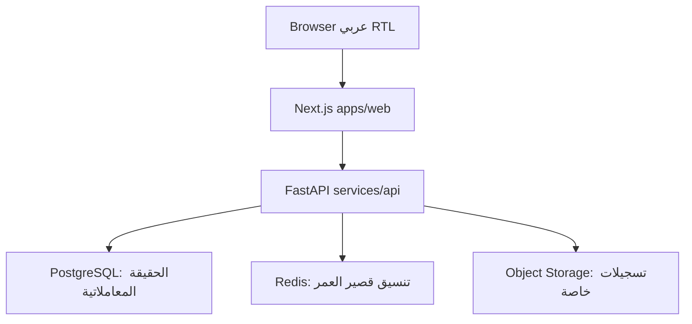
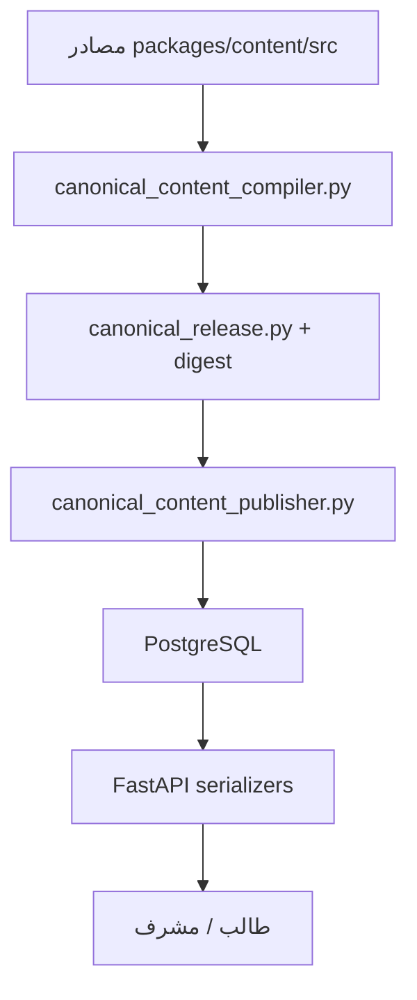

# تسليم مشروع هِمّة الكامل — بوابة المحادثة الجديدة

**نوع الوثيقة:** خريطة استلام وفهم وتنفيذ، وليست مصدر حقيقة بديلًا  
**تاريخ اللقطة:** 2026-10-07  
**المستودع:** `7eaur/himma-`  
**فرع العمل:** `improvement/himma-unified-v2-20260921`  
**طلب الدمج:** PR #8 — Draft، دون دمج أو نشر

## 0. الحكم الصريح

بدأ تنظيف المشروع والتوثيقات بالفعل، لكنه **لم يصل بعد إلى نسخة نهائية نظيفة جاهزة للدمج أو الإنتاج**.

المنجز حتى هذه اللقطة:

- توحيد مصادر الحقيقة الحالية ووضع قاعدة تمنع اعتبار كل تقرير قديم مرجعًا حاليًا.
- إنشاء جرد مبني على الاستدعاءات الفعلية للكود والأصول والحزم.
- تنفيذ دفعتين منخفضتي المخاطر لإزالة أصول مكررة/افتراضية وكود واجهة غير موصول.
- فحص جذري لمسار المحتوى والتكيّف وقاعدة البيانات والواجهات.
- إصلاح CA-01 وCA-02 وCA-03 وCA-05 وCA-06 وCA-07 وCA-08 وCA-09 على فرع التحسين.
- إصلاح بوابات الاعتماد والأمن وPostgreSQL، وتحديث Next.js إلى `16.4.0`.
- نجاح Security وFrontend وBackend في QG Run `37669828279`؛ فشل Integration لأن اختبارًا واحدًا توقع سبب تعليق واحدًا فقط بدل السببين المحددين في Runtime. صُحح التوقع محليًا، ويلزم gate جديد.

غير المنجز:

- لم يُدمج PR #8 ولم يُنشر فرع التحسين.
- لم يُتخذ القرار الأكاديمي المطلوب لحسم تداخل نشاطي L3 في CA-04.
- لم تُنفذ قيود DB الدفاعية في CA-10، لأن النسخ الاحتياطي الإنتاجي مؤجل وعمليات migration محظورة في هذه المرحلة.
- لم تُستكمل أرشفة ملفات handoff/checkpoint المؤرخة داخل مجلد أرشيف واضح.
- لم يُحسم مصير Worker الوهمي وبقية seed/repair scripts واحدًا واحدًا.
- لم تُنفذ مراجعة بصرية بشرية نهائية لكل شاشات الطالب والمشرف بعد آخر إصلاح.
- لم يُنشأ Release Candidate نهائي ولم تُنفذ موافقة دمج/نشر.

## 1. كيف تستخدم هذه الوثيقة

هذه الوثيقة تعطي المحادثة الجديدة الصورة الكاملة وتوجهها إلى المصدر الصحيح. عند التعارض، لا تجعل هذا الملف يتغلب على الكود أو الاختبارات.

ترتيب القوة:

1. الكود الحي على الفرع المقصود.
2. PostgreSQL schema وAlembic migrations.
3. الاختبارات التنفيذية وCI على SHA محدد.
4. التشغيل المتحقق منه على Railway.
5. عقود المنتج والمحتوى والصوت المعتمدة.
6. مجموعة التوثيق الحالية في `docs/ops/DOCUMENTATION_INDEX.md`.
7. ملفات handoff/checkpoint/audit المؤرخة، وهي تاريخ فقط ما لم يدرجها الفهرس الحالي.

ابدأ القراءة من:

1. `START_HERE_AR.md`
2. `docs/handoff/HIMMA_CURRENT_PROJECT_HANDOFF_AR.md`
3. `docs/ops/STATUS.md`
4. `docs/ops/progress.json`
5. `docs/specs/SOURCE_OF_TRUTH.md`
6. `docs/specs/SYSTEM_SPEC.md`
7. `docs/specs/ACCEPTANCE_MATRIX.md`
8. `docs/specs/ARCHITECTURE_BASELINE.md`
9. `docs/ops/OPEN_ITEMS.md`
10. `docs/ops/EVIDENCE_INDEX.md`

## 2. ما المشروع؟

هِمّة منصة ويب عربية RTL لتدريب طلبة الصف الثالث ذوي صعوبات القراءة، بسطحين:

- **الطالب:** يدخل بكود، ينفذ اختبارًا قبليًا، يتعلم داخل مستوى مسند له، يتلقى تقوية مستهدفة، ثم ينفذ اختبارًا بعديًا عند الجاهزية والتفعيل.
- **المشرف:** ينشئ الطلاب والأكواد، يتابع التقدم، يراجع التسجيلات، يطلب إعادة التسجيل، يدير الحالات المسموحة، يعاين المحتوى، ويصدر التقارير.

المشروع ليس أداة تشخيص طبي، ولا يجوز أن تعرض واجهة الطفل وصفًا أو وسمًا تشخيصيًا.

السعة الافتراضية الحالية 50 طالبًا عبر `HIMMA_MAX_STUDENTS`، مع احتساب الحسابات غير النشطة ضمن الحد.

## 3. رحلة المنتج وعقوده الأكاديمية

### 3.1 رحلة الطالب

1. دخول بكود أنشأه المشرف.
2. اختبار قبلي من 30 بندًا.
3. التسكين:
   - أقل من 50 → L1.
   - من 50 إلى أقل من 80 → L2.
   - 80 فأعلى → L3.
4. يبدأ الطالب من المستوى المسند؛ المستويات الأدنى متجاوزة بالتسكين وليست مكتملة اصطناعيًا.
5. نتيجة النشاط:
   - 80 فأعلى: نجاح.
   - 70 إلى أقل من 80: إعادة موجهة.
   - أقل من 70: تقوية مستهدفة من المستوى نفسه.
6. التكيّف يستخدم أحدث 3 أدلة Core صالحة من الجلسة النشطة بأوزان 50/30/20.
7. ترقية L1/L2 المبكرة تتطلب: 6 Core على الأقل، mastery لا يقل عن 85، تغطية المهارات الحرجة، critical floor لا يقل عن 70، وعدم وجود تقوية أو مراجعة صوت معلقة.
8. لا يوجد خفض تلقائي.
9. L3 نهائي ويتطلب 10 Core؛ لا يوجد L4.
10. البعدي 30 بندًا، بعد اكتمال الرحلة وتفعيل المشرف.

### 3.2 عقد الصوت

- السلطة الأكاديمية الحالية هي **مراجعة المشرف البشرية**.
- التسجيل المرفوع أو المعلق محايد أكاديميًا، وليس نجاحًا أو فشلًا.
- يستطيع الطالب إكمال الأسئلة غير المجابة بعد رفع الصوت، لكن إنهاء الجلسة ينتظر المراجعات المطلوبة.
- `rerecord_required`/`rerecord_available` مهمة مستقلة تحفظ التسجيل السابق في التاريخ.
- ممنوع Student Audio Skip وTemporary Audio Skip وFake ASR.
- ASR الإنتاجي مزود خارجي مؤجل، ولا يجوز إدخاله كسلطة أكاديمية دون قرار ومعايرة وخصوصية مستقلة.

### 3.3 المحتوى المعتمد

الإصدار: `HIMMA-CONTENT-APPROVAL-2026-09-08`.

| النوع | العدد |
|---|---:|
| قبلي | 30 |
| بعدي | 30 |
| Core | 30 |
| Reinforcement | 35 |
| الإجمالي Runtime | 125 |
| المهارات canonical | 44 |

الكتالوج الأساسي كان 105 عناصر، والزيادة 20 عنصر تقوية versioned ومعتمد؛ ليست تكرارًا قانونيًا. طبقة التجميع canonical هي نقطة التوحيد التنفيذية، ثم النشر إلى PostgreSQL.

## 4. المعمارية الفعلية

### 4.1 الواجهة

- Next.js `16.4.0`، React `19.2.8`، TypeScript، Tailwind 4.
- صفحات الطالب: الدخول، لوحة الرحلة، جلسة الاختبار، النشاط.
- صفحات المشرف: الدخول، الطلاب، إنشاء طالب، تفاصيل الطالب، مراجعة الصوت، المحتوى، التقارير، تقارير المهارات، الإعدادات، الحساب.
- يوجد Proxy API داخل Next.js؛ الواجهة لا تتصل بقاعدة البيانات مباشرة.
- لا ينبغي وضع scoring أو adaptation authority داخل JSX؛ الواجهة تعرض قرارات API.

### 4.2 الخادم

- FastAPI + SQLAlchemy + Alembic.
- Domains مركبة في `services/api/main.py`: auth، journey، assessment، activities، adaptation، reinforcement، media، recordings، review، reports، notifications، content preview، rewards.
- جميع Routers الإنتاجية التي ظهرت في الجرد مركبة؛ لم يظهر Router يتيم مؤكد.
- 15 ملف migration مصدر حاليًا. ملف migration دفاعي جُرّب ثم أزيل لأنه يخالف حظر migrations الحالي.

### 4.3 البيانات الرئيسية

- مستخدمون ومصادقة وجلسات.
- طلاب وسجل تدقيق.
- Releases/skills/content items/steps/options/assets/scoring.
- Assessment sessions/attempts/responses/idempotency.
- Audio submissions/reviews.
- Adaptation decisions/reinforcement cycles/rewards.
- Speech jobs/results موجودة تقنيًا، لكن ASR الإنتاجي ليس جزءًا مغلقًا.
- Notifications وتقارير الرحلة.

### 4.4 المحتوى من المصدر إلى الواجهة

الواجهة لا تؤلف الأسئلة ولا تختار الإجابة الصحيحة. الأسئلة والخطوات والخيارات تأتي من API، والمصدر الأكاديمي يُجمع ويُنشر حتميًا.

### 4.5 التشغيل

- الإنتاج المعروف على Railway: `friendly-dream / production`.
- فرع الإنتاج: `stage/02-content`.
- آخر SHA إنتاج موثق: `4ecb27590f7c19cbe7823804b9919d91000415ef`.
- آخر تحقق إنتاج موثق كان 2026-09-24؛ لا تُعتبر هذه العبارة فحصًا حيًا بتاريخ 2026-10-07.
- المشروع لا يستخدم Docker كبيئة تطوير أو شرط CI. ملفات `deploy/railway-*.Dockerfile` packaging خاصة بـRailway فقط.
- CI يشغل PostgreSQL وRedis وMinIO مباشرة دون containers.

## 5. ماذا تم في مرحلة التنظيف؟

### 5.1 توحيد التوثيق المنطقي

تم إنشاء نقطة دخول، فهرس current، قواعد أولوية، وحصر الحالة الحالية في ملفات محددة. هذا منع تقارير Runs القديمة من التحكم في السلوك، لكنه لم ينقل بعد جميع الملفات القديمة إلى مجلد archive.

### 5.2 Cleanup Batch 01

حُذفت عشرة أصول بلا استدعاء Runtime:

- خمسة SVG افتراضية من Next.js.
- خمس صور شخصيات مسطحة مطابقة byte-for-byte لنسخ canonical داخل مجلدات الشخصيات.

النتيجة: إزالة نحو 706 KiB دون تغيير سلوك. QG #1065 نجح بالكامل.

### 5.3 Cleanup Batch 02

حُذفت:

- `StudentAudioReviewOverlay.tsx` غير المركب.
- `useAudioRecorder.ts` غير المستدعى.
- `lib/idb.ts` دون مستهلك.
- اعتماد npm المباشر `idb` بعد زوال المستهلك الوحيد.

التسجيل النشط بقي داخل صفحتي النشاط والاختبار. إزالة هذه الملفات لا تعني إزالة ميزة التسجيل.

### 5.4 عناصر لم تُحذف بعد

| العنصر | الحالة | السبب |
|---|---|---|
| `services/worker/main.py` | يحتاج قرار | heartbeat من 12 سطرًا، غير مشغل على Railway؛ إما خدمة حقيقية أو إزالة واضحة |
| صور شخصيات غير مستدعاة | مرشح | يلزم فحص المسارات الديناميكية والبصري أولًا |
| `logo-flat.svg` | مرشح | لا استدعاء ظاهر، لكن يلزم تحقق بصري للهوية |
| redirect القديم لصورة الشخصية | إبقاء مؤقت | يحتاج access-log evidence قبل الإزالة |
| seed/repair scripts | مراجعة فردية | قد تكون أدوات صيانة أو أدلة ترحيل، ولا تحذف جماعيًا |
| `learning_state_machine.py` | غير محسوم | ليس Runtime واضحًا لكنه مستخدم في اختبارات؛ يلزم قرار domain |
| handoffs/checkpoints المؤرخة | أرشفة تنظيمية | التاريخ محفوظ، لكن مكانه الحالي يسبب ضوضاء |

## 6. تدقيق المحتوى والتكيّف وقاعدة البيانات والواجهة

| ID | المشكلة | الحالة الحالية | دليل/حد الإغلاق |
|---|---|---|---|
| CA-01 | Reinforcement دخل نافذة أدلة التكيّف رغم عقد Core-only | محلولة على فرع التحسين | الأدلة Core-only + اختبار استبعاد التقوية |
| CA-02 | `main_idea` كان مربوطًا بعنصر L3 غير مطابق | محلولة | أصبح يختار `L3-REIN-05` |
| CA-03 | `passage_fluency` كان قد يختار بناء جملة | محلولة | المرشحان `L3-REIN-04/08` |
| CA-04 | `L3-REIN-03` و`L3-REIN-12` متداخلان تربويًا | **مفتوحة — قرار أكاديمي** | لا يجوز حذف/إعادة تأليف محتوى معتمد تقنيًا |
| CA-05 | أسئلة PRE/POST المرجعية Q25–29 لم تعرض نصها السابق | محلولة | API يحل المرجع والواجهة تعرضه |
| CA-06 | `rerecord_available` غير ممثلة وقد تُفسر كاكتمال | محلولة | حالة مستقلة + اختبار واجهة |
| CA-07 | التقوية اليدوية لم تفرض `approved` | محلولة | GET/POST يرشحان approved + اختبار draft |
| CA-08 | عد التقدم لم يطابق مرشح Core المعتمد | محلولة | start/progress/finalize/selection موحدة |
| CA-09 | تنبيه خلفي أحمر كان يتسرب خلف شاشة التعليق | محلولة برمجيًا | overlay معتم + يلزم تأكيد بصري نهائي |
| CA-10 | DB تعتمد على الناشر أكثر من constraints دفاعية | **مؤجلة** | migration محظورة قبل backup/restore معتمد |

تفاصيل الأدلة: `docs/maintenance/CONTENT_ADAPTATION_DB_UI_AUDIT_2026-09-24_AR.md`.

## 7. إصلاحات الاعتمادات والبوابة

- تحديث Next.js من `16.3.4` إلى `16.4.0` لمعالجة تنبيه أمني حرج.
- توحيد Jest وJSDOM إلى `30.5.2` و`eslint-config-next` إلى `16.4.0`.
- إضافة `psycopg[binary]>=3.2,<4` لأن DSN في CI يستخدم `postgresql+psycopg`.
- تدقيق اعتماد الواجهة الإنتاجي يستخدم `npm audit --omit=dev --audit-level=high`.
- لم يُستخدم `npm audit --force` ولم تُنفذ downgrade مفسدة.
- التنبيه العالي غير المغلق لـ`braces` محصور في سلسلة ESLint التطويرية الخاصة بـNext؛ lint يبقى إلزاميًا، واعتمادات الإنتاج أظهرت صفر ثغرات في التدقيق المحلي.

## 8. الأدلة والـGit الحالية

### 8.1 الفروع

| الغرض | الفرع/SHA |
|---|---|
| الإنتاج الرسمي | `stage/02-content` عند آخر SHA موثق `4ecb275...` |
| أرشيف خط الإنتاج | `archive/production-baseline-20260921` |
| العمل | `improvement/himma-unified-v2-20260921` |
| PR | #8 Draft إلى `stage/02-content` |

### 8.2 ملاحظة SHA مهمة

بسبب تعذر push مباشر من Git المحلي، رُفعت بعض التغييرات عبر GitHub API. لذلك قد تختلف SHA المحلية عن SHA البعيدة مع تطابق الشجرة:

| الغرض | محلي | بعيد |
|---|---|---|
| إصلاح Runtime/الواجهة | `68ae627` | `48806e1e4fa47989be0a50560dccd0e8704e7859` |
| إصلاح CI/الاعتمادات | `1c4e078` | `a35afb3a370070b7f81f6b9ab61750d35582bac5` |

لا تعتمد على SHA المحلي لتحديد رأس PR البعيد؛ افحص GitHub أولًا.

### 8.3 التحقق

- محليًا بعد آخر إصلاح اعتماد: Jest 41/41، ESLint ناجح، Next build ناجح، production npm audit = 0، واختبارات الخادم المرتبطة 25 ناجحة.
- المجموعة الموسعة للخادم أعطت 565/566 أولًا؛ الفشل الوحيد fixture بترتيب صفر كشفته تجربة constraint مؤقتة. بعد إزالة migration الممنوعة وتصحيح fixture نجحت المجموعة المتأثرة.
- QG Run `37669828279` على الرأس البعيد:
  - Security: SUCCESS.
  - Frontend: SUCCESS.
  - Backend: SUCCESS.
  - Integration/Playwright: FAILURE؛ 22 نجح وواحد فشل على محاولة وإعادة محاولة.
  - السبب: `vertical-slice.spec.ts` توقع عبارة «ربط نشاط تقوية» فقط، بينما أعاد Runtime العبارة القانونية الأخرى «مراجعة المشرف بعد محاولات التقوية».
  - التصحيح المحلي: قبول السببين المحددين فقط مع بقاء تحقق ظهور overlay وعنوانه. يلزم gate جديد على الرأس المرفوع.
- Vercel check على `a35afb3...`: SUCCESS، لكنه لا يغني عن Quality Gate الكامل.

## 9. المشاكل والمخاطر المتبقية بلا مبالغة

### P1 — تمنع إعلان النسخة النهائية

1. **CA-04 قرار أكاديمي:** نشاطا L3 متداخلان. المطلوب من مالك المحتوى تحديد الدمج أو التفريق أو الإبقاء المبرر.
2. **بوابة الرأس النهائي:** كل commit توثيق/كود جديد يحتاج exact-head CI؛ لا يكفي نجاح رأس أقدم.
3. **المراجعة البصرية النهائية:** يجب تنفيذ رحلات الطالب والمشرف بعد آخر إصلاح، على الهاتف والكمبيوتر، وتوثيق اللقطات والمشكلات.
4. **Release Candidate:** لا يوجد حتى الآن commit معلن كمرشح نهائي وافق عليه المالك.

### P2 — تنظيف مهم قبل الإغلاق

1. تنظيم ملفات handoff/checkpoint/audit المؤرخة في أرشيف واضح دون حذف تاريخ Git.
2. حسم Worker: خدمة queue حقيقية أو إزالته ومحو ادعاء وجود معالجة خلفية.
3. مراجعة seed/repair scripts فرديًا وربط الباقي بـrunbook أو أرشفته.
4. مراجعة الأصول البصرية المتبقية والمسارات الديناميكية قبل الحذف.
5. إبقاء `ARCHITECTURE_BASELINE.md` متزامنًا مع الاعتمادات؛ تم تحديث Next إلى `16.4.0` في هذه الحزمة.

### P3 — مؤجل بقرار أو اعتماد خارجي

1. CA-10 constraints دفاعية لقاعدة البيانات بعد وجود backup/restore evidence.
2. مزود ASR والمعايرة والخصوصية.
3. سياسة الاحتفاظ ببيانات وتسجيلات الأطفال.
4. القبول البشري لقارئ الشاشة.
5. معلمات البروتوكول البحثي النهائي.

## 10. خطة الوصول إلى نسخة نظيفة ونهائية

### المرحلة A — إغلاق الدليل الحالي

1. رفع تصحيح توقع الرحلة الرأسية وهذه الحزمة التوثيقية.
2. تشغيل exact-head gate جديد؛ لا يعاد تشغيل الفشل القديم لأنه لا يحتوي التصحيح.
3. عند النجاح: تسجيل الدليل الجديد في `EVIDENCE_INDEX.md` و`progress.json`.

### المرحلة B — تنظيف التوثيق تنظيميًا

1. إبقاء مجموعة CURRENT صغيرة كما يحدد `DOCUMENTATION_INDEX.md`.
2. نقل handoffs/checkpoints المؤرخة إلى `docs/archive/` بتقسيم منطقي، دون حذف تاريخ Git.
3. إضافة banner تاريخي للملفات التي قد تبدو حية رغم أنها superseded.
4. إصلاح الروابط بعد النقل وفحص الروابط الداخلية.
5. عدم إنشاء handoff جديد لكل Run؛ تحديث هذا الملف الثابت والحالة/الأدلة فقط.

### المرحلة C — تنظيف التنفيذ المتبقي

1. قرار Worker.
2. مراجعة seed/repair scripts واحدًا واحدًا.
3. تنظيف الأصول المرشحة بعد إثبات عدم الاستدعاء والفحص البصري.
4. فصل dependencies الإنتاج عن الاختبار عندما يثبت أنه يقلل الغموض دون كسر CI.
5. كل دفعة commit مستقل قابل للتراجع مع بوابة كاملة.

### المرحلة D — قرارات المنتج قبل التغيير الجديد

1. اعتماد CA-04 أكاديميًا.
2. توثيق التغييرات المطلوبة الجديدة كسيناريوهات وقواعد قبول قبل تعديل الكود.
3. تحديد هل التغيير يؤثر في المحتوى المعتمد أو الدراسة أو البيانات أو الهجرات؛ إذا نعم، يلزم checkpoint مالك واضح.

### المرحلة E — مراجعة سيناريوهات وبصرية

الحد الأدنى:

- دخول الطالب والاستئناف.
- قبلي كامل بما فيه الأسئلة الصوتية والمرجع Q25–29.
- حدود التسكين الثلاثة.
- نشاط نجاح/إعادة موجهة/تقوية.
- تعليق المسار ومراجعة الصوت وإعادة التسجيل.
- ترقية L1/L2 وإغلاق L3 وعدم إنشاء L4.
- تفعيل البعدي وإكماله.
- إنشاء الطالب وإدارته ومراجعة المحتوى والتسجيلات والتقارير والتصدير.
- refresh/back/retry وانقطاع API ورفع ملف فاشل وidempotency.
- الهاتف والكمبيوتر وRTL ولوحة المفاتيح وتسميات الوصول.

### المرحلة F — Release Candidate

1. تجميد SHA مرشح.
2. تشغيل Security + Frontend + Backend + Integration + responsive + release readiness على SHA نفسه.
3. مراجعة diff من production إلى المرشح، بما فيه migrations والمحتوى والاعتمادات.
4. توثيق rollback واضح.
5. موافقة المالك على الدمج والنشر.
6. الدمج أولًا، ثم نشر مراقب؛ لا نشر مباشر من فرع التحسين.

## 11. ما لا يجوز للمحادثة الجديدة فعله

- لا تبدأ بالتعديل قبل قراءة الملفات العشرة في قسم الاستخدام والتحقق من GitHub HEAD.
- لا تعتبر ملفات handoff القديمة حقيقة حالية.
- لا تعدل `stage/02-content` مباشرة.
- لا تنشر أو تدمج دون تفويض صريح وبوابات خضراء.
- لا تنفذ migration أو حذف بيانات ما دام النسخ الاحتياطي مؤجلًا.
- لا تحذف seed/repair script أو أصلًا بناءً على الاسم فقط.
- لا تغير محتوى أكاديميًا معتمدًا لحل CA-04 دون قرار المالك الأكاديمي.
- لا تضف تقوية عشوائية أو عابرة للمستويات.
- لا تضف خفضًا تلقائيًا.
- لا تضف تخطيًا للصوت أو ASR وهميًا.
- لا تضع تسجيلات أو أسرارًا أو بيانات أطفال أو dumps داخل Git أو التقارير.
- لا تضع منطق الدرجات والتكيّف المرجعي في الواجهة.
- لا تخفف الاختبارات لتنجح البوابة.

## 12. بروتوكول استلام المحادثة الجديدة

نفذ بالترتيب:

1. اقرأ `START_HERE_AR.md` وهذه الوثيقة ومصادر الحقيقة المحددة.
2. افحص GitHub HEAD للفرعين الرسمي والعمل وPR #8، ولا تفترض أن SHA المحلي هو البعيد.
3. افحص آخر Quality Gate على الرأس نفسه.
4. اقرأ ملفات الكود المتعلقة بالتغيير المطلوب واختباراتها، لا التوثيق فقط.
5. اكتب فهمك للتغيير وتأثيره على UI/API/DB/content/tests/security.
6. قدّم خطة شرائح صغيرة ومعايير قبول ومخاطر قبل التعديل.
7. نفذ كل شريحة مع targeted tests ثم full exact-head gate.
8. حدّث فقط: STATUS/progress للحالة، EVIDENCE للدليل، OPEN_ITEMS للبنود، وهذه الوثيقة عند تغير خريطة الاستلام.

## 13. نص جاهز لبدء المحادثة الجديدة

> استلم مشروع هِمّة من المستودع `7eaur/himma-`. ابدأ من `START_HERE_AR.md` ثم `docs/handoff/HIMMA_CURRENT_PROJECT_HANDOFF_AR.md` واتبع ترتيب مصادر الحقيقة المذكور. افحص GitHub HEAD وPR #8 وCI الحي قبل أي استنتاج. اقرأ الكود والاختبارات المرتبطة بالتغيير المطلوب، ولا تعتمد على التوثيق وحده. لا تعدل أو تدمج أو تنشر قبل أن تقدم فهمًا معماريًا وسيناريوهات ومعايير قبول وخطة أثر تشمل UI/API/DB/content/security/tests. حافظ على فرع الإنتاج، ولا تنفذ migrations أو حذف بيانات ما دام النسخ الاحتياطي مؤجلًا.

## 14. الملفات المرجعية المباشرة

- الحالة: `docs/ops/STATUS.md`
- الحالة الآلية: `docs/ops/progress.json`
- البنود المفتوحة: `docs/ops/OPEN_ITEMS.md`
- الأدلة: `docs/ops/EVIDENCE_INDEX.md`
- القرارات: `docs/ops/DECISIONS.md`
- مواصفات النظام: `docs/specs/SYSTEM_SPEC.md`
- مصفوفة القبول: `docs/specs/ACCEPTANCE_MATRIX.md`
- المعمارية: `docs/specs/ARCHITECTURE_BASELINE.md`
- تدقيق المحتوى/التكيّف: `docs/maintenance/CONTENT_ADAPTATION_DB_UI_AUDIT_2026-09-24_AR.md`
- جرد التنظيف: `docs/maintenance/CLEANUP_INVENTORY_2026-09-24.md`
- نشر الإنتاج الموثق: `docs/ops/RELEASE_DEPLOYMENT_CURRENT_AR.md`

---

**حالة التسليم:** صالحة كنقطة استلام للمحادثة الجديدة، لكن المشروع نفسه ما يزال على فرع تحسين Draft وليس نسخة نهائية منشورة.
